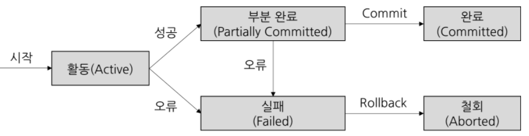

# Transaction (DB)

- 데이터베이스의 상태를 변환시키는 하나의 논리적인 작업 단위를 구성하는 연산들의 집합
- 데이터베이스 응용 프로그램은 트랜잭션들으 집합으로 정의 할 수 있다.

- 하나의 트랙잭션은 Commit 되거나 Rollback 된다

### commit 연산
- 한개의 논리적 단위(트랜잭션)에 대한 작업이 성공적으로 끝나 데이터베이스가 다시 일관된 상태에 있을 때, 이 트랜잭션이 행한 갱신 연산이 완료된 것을 트랜잭션 관리자에게 알려주는 연산이다.

### Rollback 연산

- 하나의 트랜잭션 처리가 비정산적으로 종료되어 데이터베이스의 일관성을 깨는 경우
이 트랜잭션의 일부가 정상적으로 처리 되었더라도 트랜잭션의 원자성을 구현하기 위해
이 트랜잭션이 행한 모든 연산을 취소 하는 연산

### transaction의 성질 (ACID)

- 원자성 : 트랜잭션의 모든 연산들은 정상적으로 수행 완료되거나 아니면 전혀 어떠한 연산도 수행되지 않은 상태를 보장해야 한다.
- 일관성 : 트랜잭션 완료 후에도 데이터베이스가 일관된 상태로 유지되어야 한다.
- 독립성 : 하나의 트랜잭션이 실행하는 도중에 변경한 데이터는 이 트랜잭션이 완료될 때 까지 다른 트랜잭션이 참조하지 못한다.
- 지속성 : 성공적으로 수행된 트랜잭션은 영원히 반영되어야 한다.

### transaction의 필요성
- 현금 인출기를 작동하는 도중에 예기치 않은 상황이 발생하여 카드가 나오지 않거나 기계가 멈추는 경우
- 각각 다른 지점의 은행에서 동시에 인출할 때, 하나의 지점이 다른 지점에서 저장한 잔액을 덮어 쓰는 경우

